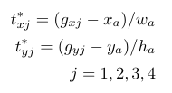

This is an oriented object detector based on [tensorflow object detection API](https://github.com/tensorflow/models/tree/master/research/object_detection).
Most of the code is not changed except for those related to the need of predicinting oriented bounding boxes rather than regular horizontal bounding boxes.

Many tasks need to predict an oriented bounding box, e.g: Scene Text Detection.
Check out the detection results:
(Note that this code doesn't train model to recognize text. Only the bounding boxes are predicted) 

<p align="center">
  
  
  
  
</p>

# Goals
For each predicted bounding boxes, in addition to the regular horizontal bounding box, we need to predict one oriented bounding box.
Basically it means that we need to regress to an oriented bounding box.
In this project, we simply regress to the encoded 4 corners of the oriented bounding boxes(8 values).
See below equation for the encoding function. j is the index for each corner. g represents ground truth oriented bounding boxes.
w_a and h_a is the anchor width and height, respectively.

<p align="center">
  
</p>

# The reason of adopting this Faster RCNN/SSD framework:
There are many object detection framework to be used. We adopt this one as the basis for the following reasons:
### Highly modular designed code
It's easy to change the encoding scheme in the code. Simply changing the code in box_coders folder.
The encoding using [R2CNN] (https://arxiv.org/abs/1706.09579) will be released soon.
Training model with faster rcnn or ssd is easy to modify.

### Natural integration with slim nets
It's easy to change feature extraction CNN backbone by using slim nets.

### Easy and clear configuration setting with google protobuf
Changing the network configuration setting is easy. For example, to change the different aspect ratios of the anchors used, simply changing the grid_anchor_generator in the configuration file.

### Many supporting codes have been provided.
It provides many supporting code such as exporting the trained model to a frozen graph that can be used in production(For example, in your c++ project).
Check out my another project [DeepSceneTextReader](https://github.com/dafanghe/DeepSceneTextReader) which used the frozen graph trained with this code.

# Code Changed compared to the original object detection implementation

### Import path for each python file
You do not need to use blaze build to build the code. Simply run the code from the root directory for fast experiment.

### proto files
added oriented related filed to the proto files. Please build them with

```
protoc protos/*.proto --python_out=.
```

### Box encoding scheme
added code for encode and decode oriented bounding boxes

### Added code in meta architecture for supporting oriented bounding box prediction
Add code to predict the oriented bounding boxes for each proposal.
At the same time the add code to calculate the oriented bounding boxes regression loss.

### Other changes regarding data reading, data decoding and others


# Usage:

## Create the tfrecord data
Use the code create_text_dataset.py to create the tfexample data files used for training.
You can create ICDAR 2015 and ICDAR 2013 data for training.

### Download the pretrained weight
If you are training faster rcnn inception resnet v2 model, you can download the [pretrained weight](http://download.tensorflow.org/models/object_detection/faster_rcnn_inception_resnet_v2_atrous_coco_2018_01_28.tar.gz) from tensorflow [model zoo](https://github.com/tensorflow/models/blob/master/research/object_detection/g3doc/detection_model_zoo.md).

### change the specific configuration setting.
See data/faster_rcnn_inception_resnet_v2_atrous_text.config for example configuration
The parameter: second_stage_localization_loss_weight_oriented is the weight for the oriented bounding box prediction.

### Train the model
Example running script is provided: train_faster_rcnn_inception_resnet_v2.sh

# Evaluation
Trained with default configuration with ResNet Inception V2 or ResNet 101 backbone on ICDAR 2013 + ICDAR 2015 training set.
The performance on ICDAR 2015 dataset.

| Backbone  | Recall | Precision | F-1 |
| --- | --- | --- | --- | 
| ResNet Inception V2 | 0.7371 | 0.8057 | 0.7699 |
| ResNet 101 | 0.6861 | 0.8213 | 0.7476 |

To improve the performance, try changing the configuration settings.
Many scene text detectors have more aspect ratios anchors for each location than that was used for regular object detection.

# TODO
1. Provide support for R2CNN training.


# Reference and Related Projects
- [Faster RCNN](https://arxiv.org/abs/1506.01497) Faster RCNN paper.
- [Tensorflow Object Detection API](https://github.com/tensorflow/models/tree/master/research/object_detection).
- [R2CNN](https://arxiv.org/abs/1706.09579) Reference paper for R2CNN.

# Contact:

* Dafang He. The Penn State University.  hdfcraig@gmail.com   http://personal.psu.edu/duh188/
